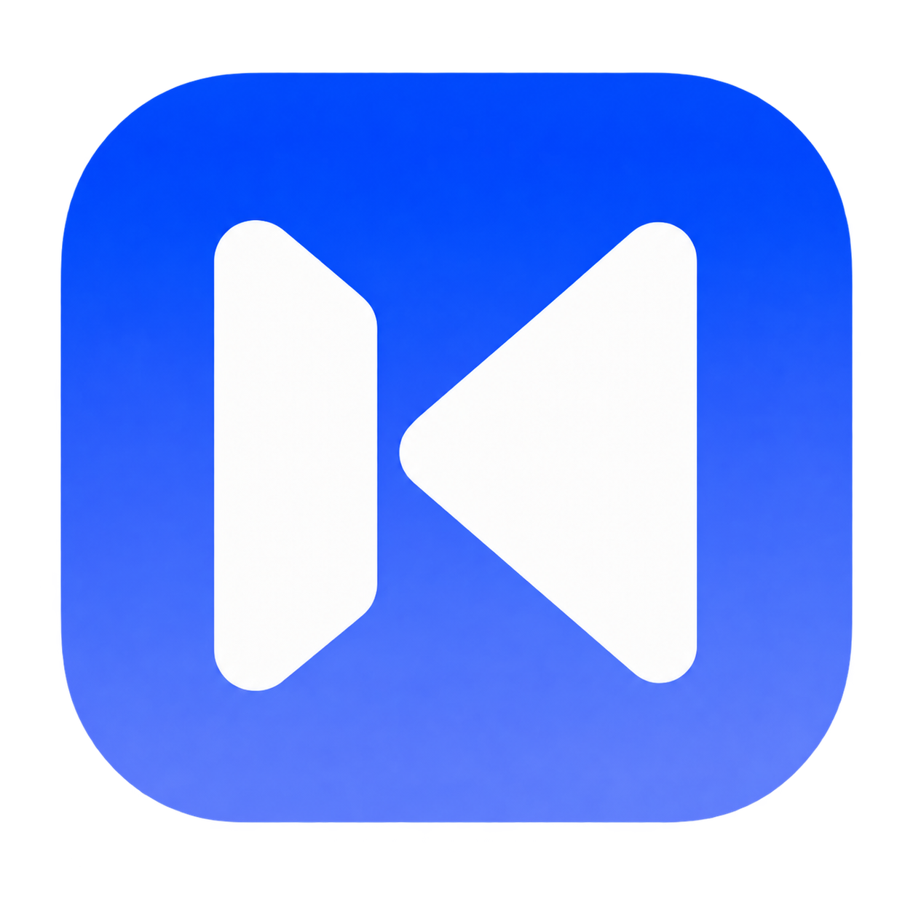
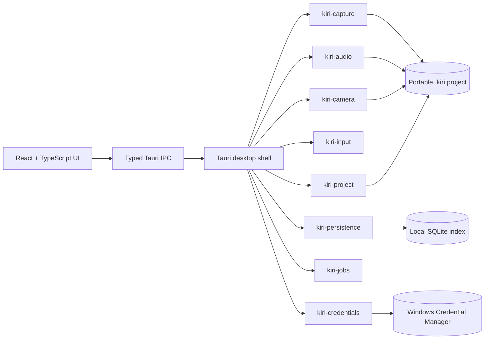

<p align="center">
  <strong>Phase 1 complete — Windows-native recording</strong>
</p>

<p align="center">
  
</p>

<h1 align="center">Kiri</h1>

<p align="center">
  <strong>Record product walkthroughs that already feel ready to present.</strong>
</p>

<p align="center">
  A premium, local-first screen recorder and editor for Windows.<br />
  Capture locally. Edit non-destructively. Keep every project yours.
</p>

<p align="center">
  
  
  
</p>

<p align="center">
  <a href="#current-status">Current status</a> ·
  <a href="#run-kiri">Run Kiri</a> ·
  <a href="#architecture">Architecture</a> ·
  <a href="docs/PRD.md">Product requirements</a> ·
  <a href="docs/DEVELOPMENT.md">Developer guide</a>
</p>

## A recording studio built around the walkthrough

Kiri is designed for product builders who want the clarity of a carefully directed demo without sending raw footage through a cloud service. It combines a compact recording experience with a Windows-native media core and a portable `.kiri` project format.

The product direction includes:

- display and application-window capture through Windows Graphics Capture
- independent microphone, system-audio, camera, cursor, and click sources
- a non-destructive timeline for zooms, trims, captions, annotations, and presentation styling
- deterministic local MP4 export
- optional AI Walkthrough planning and bidirectional MCP integrations, configured by the user

Kiri is intentionally personal and local. There are no accounts, subscriptions, analytics backend, hosted library, or required cloud services.

> [!IMPORTANT]
> Kiri is under active development. Phase 0 (foundation) and Phase 1 (native recording) are complete. The full editor, deterministic MP4 export, AI, and MCP execution are product roadmap work—not shipped features yet.

## Current status

Work proceeds phase by phase. A phase is only marked complete after its documented quality gate passes.

### Phase 1 — Windows-native recording and recoverable synchronized sources: complete

Recording is real, local, and recoverable. Phase 1 delivered:

- display and application-window capture through Windows Graphics Capture with H.264 hardware encoding
- independent microphone, system loopback audio (WASAPI), and camera (Media Foundation) sources
- cursor and click input telemetry with DPI-aware physical/logical coordinate mapping
- per-source ready offsets committed against a shared QPC recording clock, so sources that start and stop independently stay synchronized
- pause/resume segmentation into independently finalized media segments
- crash-safe recovery: forced termination mid-recording still yields every finalized segment
- source thumbnails for the picker, plus standalone capture diagnostics binaries

The development machine's measured hardware limitation—34.1 WGC frame callbacks/s on a 30-second desktop sample with zero queue drops—is measured and reported, not hidden. Full details are in [Implementation Status](docs/IMPLEMENTATION_STATUS.md) and [Verification](docs/VERIFICATION.md).

### Phase 0 — Foundation and Architecture: complete

The application can create, atomically save, index, migrate, and reopen an empty portable `.kiri` project. The foundation includes:

- a Tauri 2 desktop shell with React, strict TypeScript, and Rust
- compact Home, source-selector, and recording-controller window boundaries
- system, light, and dark themes with first-paint resolution and cross-window synchronization
- a versioned project manifest with stable IDs, rational timing, validation, and migration fixtures
- SQLite-backed local settings and recent-project indexing
- cancellable background-job primitives and typed IPC contracts
- a Windows Credential Manager boundary with an in-memory test implementation
- unit, integration, browser smoke, and golden screenshot coverage

See [Implementation Status](docs/IMPLEMENTATION_STATUS.md) and [Verification](docs/VERIFICATION.md) for the exact gate results per phase.

## The `.kiri` project

A Kiri project is a portable directory that keeps durable state separate from disposable work:

```text
My Walkthrough.kiri/
├── manifest.json       Versioned canonical project state
├── sources/            Original captured media and telemetry
├── artifacts/          Generated durable outputs
├── recovery/           Incremental recovery metadata
└── cache/              Rebuildable proxies and temporary data
```

Original captured media is never modified during editing. Project references remain normalized and relative, while saves use atomic replacement and a readable backup path.

## Run Kiri

### Requirements

- Windows 10 build 19041 or newer; Windows 11 recommended
- x64 machine
- Node.js and Corepack
- pnpm 11.22.0, pinned by the repository
- Rust 1.91.0 MSVC toolchain, pinned in `rust-toolchain.toml`
- Visual Studio 2022 Build Tools with **Desktop development with C++**
- Windows 10/11 SDK and the WebView2 Evergreen Runtime

The precise setup checklist is in [docs/DEVELOPMENT.md](docs/DEVELOPMENT.md).

### Start development

```powershell
corepack enable
pnpm install --frozen-lockfile
pnpm tauri:dev
```

### Build the desktop application

```powershell
pnpm tauri:build
```

The current configuration produces an unbundled release executable at `target/release/kiri-desktop.exe`.

## Quality gate

Run the complete verified gate for the current phase from the repository root:

```powershell
pnpm phase1:gate
```

It checks formatting, linting, strict TypeScript, frontend tests, browser smoke and golden tests, Rust formatting, Clippy with warnings denied, Rust workspace tests, and the Tauri release build. `pnpm phase0:gate` runs the same gate pinned to the Phase 0 scope.

Individual commands are also available:

```powershell
pnpm format:check
pnpm lint
pnpm typecheck
pnpm test
pnpm test:e2e
pnpm rust:fmt
pnpm rust:clippy
pnpm rust:test
```

## Architecture



Tauri commands stay thin. Capture, project, persistence, jobs, and credential behavior live in testable Rust crates that do not depend on the React interface.

```text
apps/desktop/             Tauri application and React surfaces
crates/kiri-capture/      Windows Graphics Capture screen/window recording
crates/kiri-audio/        WASAPI microphone and system loopback capture
crates/kiri-camera/       Media Foundation camera enumeration and capture
crates/kiri-input/        Cursor and click telemetry with DPI mapping
crates/kiri-project/      Project schema, validation, migration, and atomic save
crates/kiri-persistence/  SQLite migrations, settings, and recent projects
crates/kiri-jobs/         Cancellable background-job state machine
crates/kiri-credentials/  Credential-store abstraction and Windows boundary
docs/                     Product, architecture, security, ADRs, and verification
reference/                User-supplied visual references; never rewritten
```

Read [Architecture](docs/ARCHITECTURE.md), [Security](docs/SECURITY.md), and the [architecture decisions](docs/decisions/) for the design constraints behind the code.

## Product roadmap

| Phase | Scope                                                                                | Status   |
| ----- | ------------------------------------------------------------------------------------ | -------- |
| 0     | Foundation, portable projects, persistence, jobs, credentials, and application shell | Complete |
| 1     | Windows-native recording and recoverable synchronized sources                        | Complete |
| 2     | Editor, timeline, deterministic renderer, and local MP4 export                       | Next     |
| 3     | Presentation intelligence, captions, processing, and presets                         | Planned  |
| 4     | AI providers and isolated Playwright walkthrough execution                           | Planned  |
| 5     | Bidirectional MCP with explicit safety policy                                        | Planned  |
| 6     | Distribution, signing, performance, and advanced export hardening                    | Planned  |

Work proceeds one verified phase at a time. A phase is only marked complete after its documented quality gate passes.

---

<p align="center">
  <strong>Private by default. Native where it matters. Polished by design.</strong>
</p>
