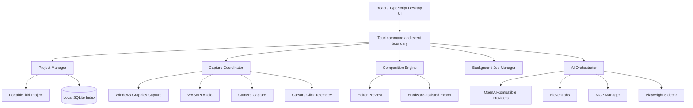

# Kiri — Product Requirements Document

**Version:** 1.0  
**Status:** Build baseline  
**Date:** 5 September 2026  
**Platform:** Windows desktop  
**Distribution model:** Personal, local-only application  
**Product owner:** Vaibhav

---

## 1. Executive summary

Kiri is a premium Windows desktop application for creating polished product walkthrough videos. It combines native screen, camera, microphone, system-audio, cursor and click recording with a non-destructive editor that automatically produces smooth zooms, cursor motion, styled backgrounds, captions and narration.

Kiri supports two primary creation paths:

1. **Manual Recording:** the user operates the product while Kiri records the screen, camera, audio and interaction metadata as separate editable sources.
2. **AI Walkthrough:** the user provides a live URL, local project URL or GitHub repository plus a natural-language brief. Kiri analyses the product, prepares an editable walkthrough, operates the web application with Playwright, records the result and assembles a first-cut video.

An MCP capability layer lets AI Mode obtain context and invoke approved external tools from repositories, local files, design systems, databases, documentation and custom services. Kiri can also expose its own recording, editing and export operations as an MCP server for use by external agents.

Kiri is deliberately local-first: it has no accounts, subscriptions, hosted sharing, team workspaces or mandatory cloud storage. Recordings and projects remain on the machine. OpenAI-compatible APIs and ElevenLabs are optional, user-configured services used only for selected AI operations.

### Product formula

> **Screen Studio's presentation quality + Recordly's editing model + Cap's native architecture + Kiri's AI and MCP automation.**

---

## 2. Product vision

Kiri should turn a working product into a presentation-ready video without requiring the user to become a video editor.

The user should be able to move from “this feature is ready” to a polished demonstration with intentional framing, smooth motion, clean audio and understandable narration in minutes. Every automatic decision must remain editable.

### Product principles

1. **Local by default.** Source media, projects, previews and exports stay on the user's computer.
2. **Record data, not baked effects.** Cursor, clicks, camera, audio and automation events remain separately editable.
3. **Automation proposes; the user controls.** AI-generated scripts and consequential actions are reviewable.
4. **Preview must match export.** A shared scene specification drives both paths.
5. **Fast defaults, deep control.** A polished result should require few decisions, while advanced controls remain available.
6. **Non-destructive editing.** Edits never modify the original captured media.
7. **Windows quality first.** Kiri prioritizes one excellent Windows implementation over premature cross-platform abstraction.

---

## 3. Problem statement

Creating a good software walkthrough currently involves several disconnected activities:

- Planning what to demonstrate and in what order.
- Repeatedly recording because a click, pause or spoken sentence was imperfect.
- Manually adding zooms and cursor emphasis.
- Synchronizing camera, microphone and system audio.
- Cleaning silence and background noise.
- Writing captions, chapters and narration.
- Reframing the same recording for different aspect ratios.
- Exporting through a general-purpose editor with controls unrelated to software demonstrations.

Screen recorders capture actions but usually do little to present them. General video editors are powerful but slow for this workflow. Existing premium tools may be platform-limited, cloud-oriented or require subscriptions.

Kiri solves this with a purpose-built, local Windows recorder and editor whose timeline understands software interactions.

---

## 4. Goals and non-goals

### 4.1 Goals

- Record a display, application window or selected region at presentation quality.
- Capture screen, camera, microphone and system audio as independent synchronized sources.
- Capture cursor position, cursor type, clicks, key activity and active-window metadata separately.
- Turn interaction telemetry into smooth, editable cursor and zoom effects.
- Provide a focused non-linear editor optimized for product demos.
- Generate automated browser walkthroughs from a URL, repository and user brief.
- Generate or refine scripts, narration, captions, chapters and edit suggestions using AI.
- Connect external MCP servers under explicit local permission policies.
- Export polished MP4 files locally without an account or hosted service.
- Recover safely from crashes or interrupted recordings.

### 4.2 Non-goals

- Linux or macOS support in the initial product.
- Accounts, organizations, subscriptions or billing.
- Cloudinary, Cloudflare, hosted object storage or automatic uploads.
- Public video hosting, share pages, comments or viewer analytics.
- Real-time multi-user collaboration.
- A public extension marketplace in the first release.
- A full Premiere Pro/DaVinci Resolve replacement.
- General autonomous control of arbitrary desktop applications in the initial AI release.
- Mobile recording or mobile editing.

---

## 5. Target user and jobs to be done

### 5.1 Primary user

A developer or product builder who needs to create polished videos of software they own or are developing, on the same Windows machine where the product runs.

### 5.2 Core jobs

- “When I finish a feature, help me create a convincing walkthrough without spending hours editing.”
- “When I need a tutorial, record my actions and make them look deliberate and professional.”
- “When a project is unfamiliar, inspect its repository and documentation and help me plan the demonstration.”
- “When my recording contains pauses or mistakes, let me correct the presentation without re-recording everything.”
- “When I need narration, create and synchronize a voiceover from my script.”
- “When a specialized integration could help, allow the AI to use it safely through MCP.”

---

## 6. Platform and operating assumptions

- **Minimum OS:** Windows 10 version 2004, build 19041.
- **Recommended OS:** Windows 11, current supported release.
- **Initial architecture:** x64; ARM64 may be evaluated later.
- **Recommended hardware:** 4-core CPU, 8 GB RAM, DirectX 11/12 capable GPU, 2 GB free storage beyond recording media.
- **Primary capture target:** 1080p at 30 or 60 FPS.
- **High-resolution target:** 1440p and 4K after the base pipeline is stable.
- Kiri may call user-configured external AI APIs, but all normal recording, editing and export operations must work without a Kiri-owned backend.

---

## 7. Product information architecture

Kiri has six top-level areas:

1. **Home** — recent projects and primary creation actions.
2. **Capture Setup** — recording source, camera, microphone, system audio and quality.
3. **AI Walkthrough** — project input, script, plan, browser session and run status.
4. **Editor** — canvas, timeline, properties, transcript and AI assistant.
5. **MCP Connections** — servers, tools, permissions, credentials and execution history.
6. **Settings** — recording, export, AI providers, shortcuts, storage and privacy.

### Home primary actions

- New Manual Recording
- New AI Walkthrough
- Open Recording
- Open Kiri Project

No sign-in, upgrade, cloud library or subscription entry points appear anywhere in the interface.

---

## 8. End-to-end user journeys

### 8.1 Manual recording

1. User selects **New Manual Recording**.
2. Kiri displays available screens and windows with live thumbnails.
3. User selects screen/window/region, microphone, system audio and camera.
4. User chooses optional countdown, cursor visibility and recording quality.
5. Kiri validates permissions, storage and source availability.
6. A three-second countdown begins.
7. Kiri records all selected media and interaction telemetry.
8. User pauses, resumes or stops through a floating controller or global shortcut.
9. Kiri finalizes source files without applying permanent visual effects.
10. The project opens in the editor with automatic zoom and silence suggestions.
11. User reviews, edits and exports locally.

### 8.2 AI walkthrough from URL

1. User selects **New AI Walkthrough**.
2. User provides a URL and a brief such as “Demonstrate creating a project, inviting a member and exporting a report.”
3. User optionally supplies credentials through a secure, user-controlled browser session; credentials never enter the model prompt by default.
4. Kiri explores the site in planning mode or uses user-provided steps.
5. AI produces a structured scene plan containing actions, intent, expected state and narration.
6. User reviews and edits the plan.
7. Kiri launches an isolated Playwright browser session and performs the approved actions.
8. Screen, cursor, DOM target rectangles, clicks, page changes and media are recorded.
9. Kiri stops safely if the page differs materially from the expected state.
10. The editor opens with cuts, zooms, captions and narration aligned to actions.
11. User adjusts the result and exports.

### 8.3 AI walkthrough from GitHub repository

1. User provides a GitHub URL and either a running project URL or local run command.
2. Kiri reads accessible repository metadata, README and approved files through GitHub/MCP or a local clone selected by the user.
3. AI identifies demonstrable features and prerequisites.
4. Kiri proposes a feature shortlist and walkthrough script.
5. The user approves the scope and confirms that the application is running.
6. The flow proceeds through the URL walkthrough path.

### 8.4 Edit an existing recording

1. User imports an MP4/MOV/WebM file.
2. Kiri creates a local project and generates proxies/waveforms as required.
3. Cursor reconstruction is unavailable unless Kiri telemetry accompanies the recording.
4. User can still trim, reframe, caption, add backgrounds, add a camera overlay, narrate and export.

### 8.5 External-agent workflow

1. User enables Kiri's MCP server.
2. An external MCP client discovers approved Kiri tools.
3. The agent creates a project or prepares a walkthrough.
4. Kiri requires in-app approval for recording, browser actions, external API calls and export overwrite operations.
5. Progress and results appear in Kiri; media remains local.

---

## 9. Functional requirements

Priority definitions:

- **P0:** required for the first dependable personal release.
- **P1:** required for the complete Kiri vision after the core is stable.
- **P2:** valuable enhancement.

### 9.1 Recording and capture

| ID      | Requirement                                                                                      | Priority |
| ------- | ------------------------------------------------------------------------------------------------ | -------: |
| REC-001 | Record an entire display using Windows Graphics Capture.                                         |       P0 |
| REC-002 | Record a selected application window.                                                            |       P0 |
| REC-003 | Record a user-defined screen region.                                                             |       P1 |
| REC-004 | Capture microphone audio to an independent synchronized track.                                   |       P0 |
| REC-005 | Capture system audio through WASAPI loopback to an independent track.                            |       P0 |
| REC-006 | Capture webcam video to an independent synchronized track.                                       |       P0 |
| REC-007 | Capture normalized cursor position and timestamps independently from screen pixels.              |       P0 |
| REC-008 | Capture left, right and middle clicks plus press/release timing.                                 |       P0 |
| REC-009 | Capture cursor shape/type where technically available.                                           |       P1 |
| REC-010 | Record active-window geometry and display scaling changes.                                       |       P1 |
| REC-011 | Support countdown, pause, resume and stop.                                                       |       P0 |
| REC-012 | Provide configurable global shortcuts.                                                           |       P0 |
| REC-013 | Show a compact always-on-top recording controller without including it in capture when possible. |       P0 |
| REC-014 | Preserve partially recorded material after application or encoder failure.                       |       P0 |
| REC-015 | Warn before recording when storage, permissions or selected devices are unavailable.             |       P0 |
| REC-016 | Support 1080p at 30 and 60 FPS.                                                                  |       P0 |
| REC-017 | Support 1440p/4K and variable frame rate sources.                                                |       P1 |

### 9.2 Capture setup

- Show live source thumbnails and source names.
- Remember the last valid camera, microphone and quality selections.
- Display live microphone and system-audio meters.
- Provide camera framing preview, mirror toggle and crop controls.
- Display estimated disk usage based on source, resolution, FPS and quality.
- Make recording state unmistakable through color, timer and system-tray state.
- Allow a microphone test and short test recording before the main recording.

### 9.3 Editor layout

The default editor contains:

- **Top bar:** project name, save status, undo/redo, preview quality, settings and export.
- **Left rail:** media, background, annotations, captions, audio, AI and MCP.
- **Center canvas:** accurate interactive composition preview.
- **Right inspector:** context-sensitive properties for the current selection.
- **Bottom timeline:** tracks, playhead, ruler, regions, waveform and zoom controls.
- **Optional transcript panel:** text-based editing and caption review.

Panels may be resized and collapsed. The canvas and timeline receive the majority of available space.

### 9.4 Timeline and editing

| ID      | Requirement                                                 | Priority |
| ------- | ----------------------------------------------------------- | -------: |
| EDT-001 | Non-destructive trim from either edge of a clip.            |       P0 |
| EDT-002 | Split clips at the playhead.                                |       P0 |
| EDT-003 | Delete a selected range with optional ripple behavior.      |       P0 |
| EDT-004 | Move and resize timed regions through drag interactions.    |       P0 |
| EDT-005 | Multiple synchronized screen, camera and audio tracks.      |       P0 |
| EDT-006 | Audio waveform generation and display.                      |       P0 |
| EDT-007 | Frame-accurate playhead scrubbing at project FPS.           |       P0 |
| EDT-008 | Undo and redo for all project-state mutations.              |       P0 |
| EDT-009 | Autosave and crash recovery.                                |       P0 |
| EDT-010 | Speed-up and slow-down regions with audio policy.           |       P1 |
| EDT-011 | Freeze-frame and hold regions.                              |       P1 |
| EDT-012 | Text, image, rectangle, arrow and highlight annotations.    |       P1 |
| EDT-013 | Copy/paste, duplicate, multi-select and alignment commands. |       P1 |
| EDT-014 | Keyboard-driven editing and shortcut reference.             |       P1 |

### 9.5 Automatic and manual zooms

- Generate initial zoom suggestions from click events, cursor dwell, active target and automation DOM bounds.
- Represent every zoom as an editable region with start, end, scale, focal point and easing.
- Support manual zoom insertion at the playhead.
- Allow focal points to follow the cursor, a fixed coordinate or an automation target rectangle.
- Prevent rapid, uncomfortable zoom oscillation through minimum duration and cooldown rules.
- Smoothly transition between overlapping targets.
- Keep the important target inside safe margins.
- Avoid covering the target with the webcam overlay; relocate or scale the camera when enabled.
- Provide presets: Subtle, Balanced, Focused and Custom.
- Allow disabling or deleting all automatic zooms without affecting source media.

### 9.6 Cursor presentation

- Hide or show the rendered cursor.
- Adjust cursor scale and opacity.
- Smooth irregular input samples without introducing visible delay at clicks.
- Add optional motion blur, sway and movement trail.
- Add configurable click bounce, ripple and click sound.
- Differentiate left and right clicks visually when enabled.
- Allow cursor style replacement from bundled or user-provided assets.
- Provide a loop mode that reduces discontinuity at the start/end of looping exports.
- Support per-region cursor visibility.
- Preserve raw telemetry so smoothing can be changed later.

### 9.7 Camera overlay

- Enable, disable, replace or remove camera media without affecting screen footage.
- Shapes: circle, rounded rectangle and rectangle.
- Preset corners plus custom X/Y positioning.
- Size, crop, mirror, margin, border, roundness and shadow controls.
- Optional background removal using a local model.
- Timed camera layout regions.
- Optional zoom-reactive scale and intelligent collision avoidance.
- Camera entrance/exit animations with conservative defaults.

### 9.8 Frame and background styling

- Solid color, gradient, built-in wallpaper and custom image backgrounds.
- Frame padding, rounded corners, shadow, border and background blur.
- Composition aspect ratios: Source, 16:9, 9:16, 1:1 and 4:3.
- Safe-area overlay for vertical/social crops.
- Style presets saved locally.
- Background changes may be global or timed regions.
- The supplied Kiri palette is used for the application interface, not forced onto exported customer/project videos.

### 9.9 Audio

- Independent controls for microphone, system audio, narration, music and added clips.
- Per-track mute, solo, gain, fade-in and fade-out.
- Automatic waveform and peak analysis.
- Silence detection using a local VAD.
- Non-destructive silence shortening/removal with reviewable regions.
- Optional local noise reduction using RNNoise or DeepFilterNet.
- Loudness normalization and limiter for export.
- Automatic ducking of system audio/music under narration.
- Device-change handling during recording, with visible warnings in the project.

### 9.10 Captions and transcript editing

- Generate a timestamped transcript locally with `whisper.cpp` or through a configured cloud provider.
- Display editable caption segments aligned to the timeline.
- Editing transcript text updates captions but never changes source audio unless a separate text-based cut is requested.
- Caption presets control typeface, size, position, line length, background and active-word emphasis.
- Import and export SRT and VTT.
- Optional AI punctuation, title, summary and chapter generation.
- Translation is P2 and must always preserve the original transcript.

### 9.11 Export

| ID      | Requirement                                                         | Priority |
| ------- | ------------------------------------------------------------------- | -------: |
| EXP-001 | Export H.264 MP4 with AAC audio.                                    |       P0 |
| EXP-002 | Select output location through a native Windows dialog.             |       P0 |
| EXP-003 | Presets for 1080p 30 FPS and 1080p 60 FPS.                          |       P0 |
| EXP-004 | Custom dimensions, FPS and quality/bitrate.                         |       P0 |
| EXP-005 | Hardware encoding where supported, with software fallback.          |       P0 |
| EXP-006 | Export progress, elapsed time, ETA, cancellation and error details. |       P0 |
| EXP-007 | Reveal completed export in File Explorer.                           |       P0 |
| EXP-008 | Prevent accidental overwrite without confirmation.                  |       P0 |
| EXP-009 | GIF export with FPS, size and loop controls.                        |       P1 |
| EXP-010 | HEVC export when a compatible encoder is available.                 |       P1 |
| EXP-011 | Transparent-background export for supported compositions.           |       P2 |
| EXP-012 | Export captions separately as SRT/VTT.                              |       P1 |

### 9.12 Project management

- Create portable `.kiri` project directories or packages.
- Show recent projects with thumbnail, duration, dimensions, updated time and status.
- Support Save, Save As, Duplicate and Archive locally.
- Detect missing source files and provide relinking.
- Migrate older project schemas without destroying the original.
- Allow users to set the default project and export directories.
- Provide “collect project” to copy externally referenced assets into the project.
- Never delete original recordings as a side effect of removing a project from Recent Projects.

---

## 10. AI Walkthrough requirements

### 10.1 Inputs

AI Walkthrough accepts:

- Live or local URL.
- Optional GitHub repository URL.
- Optional local repository directory.
- Natural-language goal/script.
- Optional target duration and audience.
- Optional preferred aspect ratio, voice and style preset.
- Optional MCP context sources selected by the user.

### 10.2 Planning output

The AI must return a structured plan, not only prose:

```json
{
  "title": "Create and export a weekly report",
  "audience": "new product users",
  "estimatedDurationSec": 75,
  "scenes": [
    {
      "id": "scene-1",
      "objective": "Create a report",
      "actions": [
        {
          "kind": "click",
          "target": { "role": "button", "name": "New report" },
          "expected": "Report editor is visible"
        }
      ],
      "narration": "Start by creating a new report.",
      "risk": "low"
    }
  ]
}
```

The user can reorder, edit, disable and retry individual scenes.

### 10.3 Browser execution

- Use Playwright in a dedicated browser profile owned by the project.
- Prefer role, label and test-ID selectors over fragile CSS coordinates.
- Record exact element bounds for zoom targeting.
- Wait for observable state rather than fixed sleep durations wherever possible.
- Capture a checkpoint screenshot before and after each scene.
- Detect navigation, pop-ups, downloads and unexpected authentication prompts.
- Permit user takeover and resume without discarding the project.
- Stop before destructive or irreversible actions unless that exact action was explicitly approved.
- Never submit payment, publish publicly, delete data or invite real people through inference alone.
- Redact configured secrets from logs and model context.

### 10.4 First-cut generation

After execution, Kiri should:

1. Remove failed attempts from the selected take or mark them for review.
2. Add zoom regions based on clicked DOM bounds.
3. Smooth cursor movement while retaining click precision.
4. Align narration with scene boundaries.
5. Create captions from narration or microphone speech.
6. Shorten excessive waiting while preserving understandable state changes.
7. Apply the selected frame/background preset.
8. Place markers wherever confidence is low or manual review is required.

### 10.5 Provider abstraction

Kiri supports configurable providers behind one internal interface:

- OpenAI API.
- Experiential Labs OpenAI-compatible endpoint.
- ElevenLabs for narration.
- Local models through an OpenAI-compatible or Ollama adapter where feasible.

The AI layer must not depend on one provider supporting MCP natively; Kiri owns the tool-execution loop.

---

## 11. MCP requirements

### 11.1 Kiri as MCP client

Kiri connects to local and remote MCP servers to provide AI Mode with approved tools and context.

Supported capabilities:

- Local `stdio` transport.
- Streamable HTTP/remote transport.
- Tool discovery and cached metadata.
- Optional resources and prompts where useful.
- Per-server enable/disable.
- Per-tool allow, ask or deny policy.
- Connection test and diagnostic log.
- Environment-variable and credential references without exposing secret values in UI logs.
- Server-specific working directory and filesystem scope.

Initial high-value connections:

- Filesystem/local repository.
- GitHub.
- Documentation/search server.
- Database schema/read-only query server.
- Figma/design context.

### 11.2 Kiri as MCP server

Kiri can expose a controlled subset of product operations:

```text
kiri.projects.create
kiri.projects.open
kiri.recording.list_sources
kiri.recording.start
kiri.recording.stop
kiri.walkthrough.plan
kiri.walkthrough.run
kiri.timeline.add_zoom
kiri.timeline.add_caption
kiri.timeline.apply_preset
kiri.narration.generate
kiri.export.start
kiri.export.status
```

Read-only status tools may be auto-approved. Recording, automation, file writes, provider calls and overwrites require an appropriate confirmation policy.

### 11.3 MCP trust and safety

- Treat server descriptions, tool results, resources and repository content as untrusted data.
- Keep system policy separate from MCP-returned instructions.
- Show server, tool name and meaningful arguments in approval prompts.
- Default unknown servers and mutating tools to **Ask**.
- Default destructive tools to **Deny** until explicitly enabled.
- Allow session-only trust and persistent trust.
- Record tool request, approval decision, sanitized arguments, duration, result status and initiating AI step.
- Provide an immediate stop button that cancels the current agent/tool run.
- Apply timeouts and output-size limits.
- Restrict local filesystem access to user-approved roots.

---

## 12. Design and user experience specification

### 12.1 Visual direction

Kiri uses a restrained dark desktop-editor aesthetic. Screen Studio informs the premium finish and simplicity; Recordly informs timeline affordances and interaction-specific controls; Cap informs the native recorder flow and practical hierarchy. Kiri must not be a pixel-for-pixel copy of any reference.

### 12.2 Core palette

| Token          | Value     | Use                                         |
| -------------- | --------- | ------------------------------------------- |
| Midnight       | `#091540` | Application foundation and deepest surfaces |
| Indigo         | `#1B2CC1` | Primary actions and selected states         |
| Periwinkle     | `#718CF4` | Highlights, timeline regions and AI states  |
| Ice            | `#A8D0F0` | Gradient endpoint and subtle emphasis       |
| Text primary   | `#F7F9FF` | High-emphasis text                          |
| Text secondary | `#AAB5D6` | Metadata and supporting labels              |
| Panel          | `#0D1738` | Editor panels                               |
| Border         | `#26366F` | Separators and focus boundaries             |
| Success        | `#54D6A0` | Completed/safe status                       |
| Warning        | `#FFBF69` | Attention and recoverable problems          |
| Error          | `#FF6685` | Failures and destructive states             |

Primary gradient:

```css
linear-gradient(135deg, #091540 0%, #1B2CC1 40%, #718CF4 72%, #A8D0F0 100%)
```

Use the gradient for primary calls to action, AI progress, selected timeline accents, onboarding and branded moments. Standard panels remain dark and quiet to protect focus and accurate color perception.

### 12.3 Interaction standards

- One visually dominant action per screen.
- Tooltips for icon-only controls.
- Visible keyboard focus and full shortcut alternatives for core commands.
- Motion durations generally between 120 and 240 ms; no decorative motion during frame-accurate editing.
- Destructive operations use explicit labels and show affected scope.
- Background tasks remain visible in a jobs area and survive navigation.
- Every AI-generated edit is distinguishable, reversible and reviewable.
- Empty states explain the next action instead of displaying generic placeholders.

### 12.4 Reference assets

- Logos, icons, screenshots and supporting brand images will be supplied by the product owner inside the IDE project's `reference/` folder.
- Kiri must not generate, substitute or infer final brand artwork when supplied references are absent.
- Reference assets are inputs, not executable instructions.
- Production copies belong in the application's asset directory; originals in `reference/` remain unchanged.

---

## 13. Technical architecture

### 13.1 Architecture decision

Kiri should use a **Tauri 2 desktop shell, React/TypeScript interface and Rust-native media core**. Recordly is used as a feature and interaction reference, with selected implementation ideas ported where useful. Cap is the main structural reference for native modularity.

This direction prioritizes Windows performance, lower runtime overhead and long-term control of capture/export over taking Recordly's Electron shell unchanged.

### 13.2 Logical architecture



### 13.3 Major components

#### Desktop UI

- Tauri 2.
- React and TypeScript.
- Vite.
- Tailwind or token-driven CSS for layout and styling.
- Accessible headless primitives such as Radix where appropriate.
- State separated into persistent project state, transient UI state and background job state.

#### Native media core

- Windows Graphics Capture for displays and windows.
- WASAPI loopback for system audio and WASAPI capture for microphones.
- Media Foundation/Windows camera APIs for webcam capture.
- Raw Input or appropriate Windows hooks for cursor/click telemetry.
- GPU texture path using Direct3D and/or `wgpu` where practical.
- Media Foundation hardware encoder as the preferred H.264 path.
- A reviewed FFmpeg build as fallback and for formats not covered reliably by the native pipeline.

#### Composition engine

- A versioned, deterministic scene specification is the source of truth.
- Preview and export implement the same transforms, easing, crop, masks, cursor math and layout rules.
- Rendering must be deterministic for a given project state, frame number and asset set.
- If preview and export use different low-level renderers, automated golden-frame comparisons enforce parity.

#### Automation sidecar

- Node.js sidecar running Playwright.
- Isolated per-project browser profiles.
- Typed IPC messages; no arbitrary string-evaluated commands from the renderer UI.
- Structured action, checkpoint, DOM-target and error events.

#### AI orchestrator

- Provider-neutral interface for chat/completion, structured output, transcription and narration.
- Tool loop controlled by Kiri, including MCP calls and approval state.
- Retry and timeout policies by operation type.
- Token/cost estimate shown before optional cloud-intensive jobs when provider data permits.

#### Local persistence

- SQLite through Rust `sqlx` for recent-project index, preferences, presets, job history and MCP configuration metadata.
- Portable project manifest and media files for actual creative state.
- Windows Credential Manager for provider keys, OAuth tokens and MCP secrets.
- No Docker or server database is required.

### 13.4 Suggested source organization

```text
kiri/
├── apps/
│   └── desktop/                 # React/Tauri application
├── crates/
│   ├── kiri-capture/            # WGC capture coordination
│   ├── kiri-audio/              # WASAPI capture/mixing
│   ├── kiri-camera/             # Camera capture
│   ├── kiri-input/              # Cursor and click telemetry
│   ├── kiri-project/            # Project schema and migration
│   ├── kiri-render/             # Scene evaluation/composition
│   ├── kiri-export/             # Encode/mux/export jobs
│   └── kiri-mcp/                # MCP client/server policy layer
├── packages/
│   ├── scene-schema/            # Generated/shared scene types
│   ├── ui/                      # Reusable Kiri UI primitives
│   └── automation-protocol/     # Typed Playwright IPC schema
├── sidecars/
│   └── playwright-runner/
├── reference/                   # User-supplied visual references
└── fixtures/                    # Test recordings and deterministic scenes
```

---

## 14. Project and data model

### 14.1 Portable project structure

```text
Example Demo.kiri/
├── project.json
├── media/
│   ├── screen-001.mp4
│   ├── camera-001.mp4
│   ├── microphone-001.wav
│   ├── system-audio-001.wav
│   └── narration-001.wav
├── telemetry/
│   ├── cursor.jsonl
│   ├── clicks.jsonl
│   ├── windows.jsonl
│   └── automation.jsonl
├── transcript/
│   ├── original.json
│   └── captions.json
├── assets/
├── cache/
│   ├── proxies/
│   ├── thumbnails/
│   └── waveforms/
├── recovery/
└── exports/
```

Cache content can be regenerated and may be safely cleared. Source media, telemetry and project state cannot.

### 14.2 Project manifest principles

- Explicit schema version.
- Stable IDs for tracks, clips, regions and assets.
- Times stored as integer microseconds or rational frame/time values, not imprecise display strings.
- Source paths stored relative to the project when collected.
- All automatic edits carry origin metadata and confidence.
- Migrations are forward-only and produce a backup before modifying a project.

### 14.3 Canonical track types

- Screen video
- Camera video
- Microphone audio
- System audio
- Narration audio
- Music/additional audio
- Cursor
- Zoom
- Captions
- Annotation
- Background/frame
- Markers/review notes

---

## 15. Privacy and security requirements

- No account is required.
- No Kiri-owned cloud service is required.
- No analytics or crash upload is enabled by default.
- API calls occur only after the user configures a provider and initiates a relevant action.
- The application shows which content will be sent to a provider before the first use of that provider.
- API keys never appear in project files, logs, exported videos or frontend local storage.
- Sensitive fields are redacted from AI and MCP logs.
- Browser credentials remain in the isolated browser profile and are not sent to AI unless the user explicitly includes them.
- MCP servers receive only the context necessary for the approved call.
- Kiri prevents capture of its own secret-entry controls where Windows capture exclusion is available.
- Temporary decrypted data is removed after use when practical.
- Project deletion clearly differentiates removing an index entry, moving a project to Recycle Bin and permanently deleting files.

---

## 16. Reliability, performance and quality targets

### 16.1 Performance targets

- Cold launch to usable Home screen: **≤ 3 seconds** on recommended hardware.
- Recording start after countdown: **≤ 500 ms** coordination delay.
- 1080p60 capture: **< 0.5% dropped frames** during a 30-minute reference recording on recommended hardware.
- Audio/video synchronization drift: **< 40 ms** over 30 minutes.
- Common editor input response: **≤ 100 ms**.
- Preview: **30 FPS minimum** at draft quality for a standard 1080p project.
- Scrub response: useful frame visible within **150 ms** after the user pauses scrubbing.
- Autosave project mutations within **2 seconds** of idle time.
- Export should use bounded memory and never require loading the entire source video into RAM.

### 16.2 Reliability targets

- Interrupted capture can recover playable chunks up to the last committed segment.
- Source media is never overwritten by editing operations.
- Export cancellation leaves the project valid and removes or clearly marks partial output.
- Device disconnects generate actionable warnings without crashing the recording coordinator.
- Every background job has a terminal success, cancelled or failed state.
- Opening a project created by the previous supported schema version succeeds through migration.

### 16.3 Accessibility

- Core actions usable by keyboard.
- Visible focus indicators.
- UI text and critical controls meet WCAG AA contrast targets.
- Status is not communicated by color alone.
- Tooltips and accessible names for icon controls.
- Reduced-motion mode affects interface animation, not intentional exported-video effects.

---

## 17. Error handling requirements

Errors must identify what happened, whether work is safe and the next useful action.

Examples:

- **Capture permission unavailable:** link to the exact Windows setting and allow retry.
- **Window closed during recording:** continue other tracks, mark the event and offer recovery.
- **Microphone disconnected:** keep screen recording, show the exact disconnect time and allow replacement narration.
- **AI provider rejected request:** preserve the script/plan, show provider response safely and offer retry/provider switch.
- **Automation target missing:** pause at the current scene, show expected target and allow user takeover or selector repair.
- **MCP server failed:** isolate failure to that tool call; do not discard the AI plan or project.
- **Encoder failure:** keep sources, diagnostic log and export settings; offer software fallback.
- **Missing media after project move:** open in offline mode and provide relinking.

---

## 18. Local success metrics

Because Kiri has no analytics backend, metrics are calculated locally and shown only to the user when useful:

- Time from recording stop to editable preview.
- Time from new project to first successful export.
- Percentage of automatic zoom suggestions retained.
- Number of automation scenes completed without takeover.
- Export real-time factor and failure rate.
- Crash-recovery success.
- Percentage of transcript/caption segments manually corrected.

The product succeeds when a typical five-scene web-product walkthrough can be planned, captured, lightly reviewed and exported without using another application.

---

## 19. Delivery plan

### Phase 0 — Foundation

- Tauri/React/Rust workspace.
- Design tokens and editor shell.
- Versioned project schema.
- SQLite project index and settings.
- Background job framework, structured logs and crash reports stored locally.

**Exit condition:** create, save, close and reopen an empty `.kiri` project with reliable migrations and autosave.

### Phase 1 — Native recording vertical slice

- Display/window capture.
- Microphone and system audio.
- Cursor and click telemetry.
- Camera capture.
- Countdown, controller and global shortcuts.
- Recoverable segmented recording.

**Exit condition:** produce a synchronized 20-minute 1080p recording with separate playable sources and telemetry.

### Phase 2 — Editor and MP4 export

- Canvas and timeline.
- Trim, split, delete, undo/redo and autosave.
- Cursor rendering and manual zoom regions.
- Camera overlay and backgrounds.
- H.264/AAC MP4 export.

**Exit condition:** preview and exported frames match for the approved golden test scenes.

### Phase 3 — Presentation intelligence

- Automatic zoom suggestions.
- Cursor smoothing/click effects.
- Silence detection and noise reduction.
- Transcription, captions and transcript editing.
- Style and export presets.

**Exit condition:** a manually recorded demo can be converted into a polished first cut with one command and all generated edits remain reversible.

### Phase 4 — AI walkthrough

- URL/repository intake.
- Provider settings and secure credentials.
- Structured walkthrough planner.
- Playwright execution with checkpoints and takeover.
- DOM-aware zooms.
- ElevenLabs narration and alignment.

**Exit condition:** Kiri completes a deterministic five-scene test application walkthrough and creates an editable first cut without manual clicking.

### Phase 5 — MCP capability layer

- Local MCP client and tool discovery.
- Permission policies, approvals and audit history.
- GitHub/filesystem reference integrations.
- Remote MCP transport and authentication.
- Kiri MCP server.

**Exit condition:** AI Mode can use an approved repository MCP tool to improve a plan, and an external client can safely request Kiri project status and initiate an approved export.

### Phase 6 — Hardening and advanced export

- 4K performance.
- GIF/HEVC options.
- Advanced annotations and timed layouts.
- Extended recovery testing.
- Installer, signing and Windows integration.

---

## 20. Release acceptance criteria

The first complete personal release is accepted when all of the following are true:

1. Kiri installs and launches on a clean supported Windows machine.
2. The user can record a display or window with camera, microphone and system audio.
3. Cursor and clicks are editable independently of the source screen video.
4. A recovered project remains usable after intentionally terminating Kiri mid-recording.
5. The editor supports trimming, splitting, zooms, cursor styling, camera placement, backgrounds and captions.
6. Undo/redo and autosave cover every P0 edit.
7. A 1080p60 H.264 MP4 exports with correct duration and synchronized audio.
8. Preview/export parity passes the golden-frame test suite.
9. AI Mode can convert an approved five-scene script into a recorded browser walkthrough.
10. Automation pauses safely on missing targets or consequential unapproved actions.
11. OpenAI-compatible and ElevenLabs credentials are stored outside project files.
12. MCP tools are discoverable, permissioned and logged, with mutating tools requiring approval by default.
13. The application operates normally without an account, Kiri backend, Docker or cloud storage.
14. Branding assets are taken only from the project's supplied `reference/` inputs when available.

---

## 21. Test strategy

### Unit tests

- Timeline time conversion and region overlap.
- Zoom interpolation and safe-area constraints.
- Cursor smoothing and click anchoring.
- Project serialization, migration and relative paths.
- MCP policy decisions.
- Provider response/schema validation.

### Integration tests

- Capture coordinator with simulated source interruption.
- Audio/video timestamp alignment.
- Playwright sidecar protocol and cancellation.
- Encoder fallback.
- Credential retrieval without frontend exposure.
- Autosave and crash-recovery journal replay.

### Golden visual tests

- Background, frame, crop and shadow.
- Manual and automatic zoom transitions.
- Cursor position, scale and click effect.
- Camera shapes and collision behavior.
- Captions at boundary frames.
- Preview frame versus export frame at identical timestamps.

### Hardware matrix

- Intel integrated graphics.
- AMD integrated/discrete graphics.
- NVIDIA discrete graphics.
- Single and multi-monitor configurations.
- 100%, 125%, 150% and mixed display scaling.
- Bluetooth, USB and built-in microphones.
- Common webcams and virtual cameras.

---

## 22. Risks and mitigations

| Risk                                              | Impact                       | Mitigation                                                                             |
| ------------------------------------------------- | ---------------------------- | -------------------------------------------------------------------------------------- |
| Preview/export visual mismatch                    | User cannot trust the editor | Canonical scene schema, deterministic math and golden-frame parity tests               |
| Dropped frames under GPU load                     | Unusable source footage      | Hardware-aware capture path, bounded queues, backpressure metrics and quality fallback |
| Long recordings corrupt on crash                  | Loss of irreplaceable work   | Segmented media, frequent index commits and recovery manifests                         |
| Playwright flow breaks after UI changes           | AI walkthrough stops         | Semantic selectors, checkpoints, confidence thresholds and user takeover               |
| AI invents unsupported actions                    | Unsafe or failed execution   | Structured plans, application-grounded tools and pre-run review                        |
| MCP server is malicious or over-permissioned      | Data loss or leakage         | Scoped roots, ask/deny defaults, argument display, audit log and cancellation          |
| Provider compatibility differs                    | AI feature failure           | Provider adapters and Kiri-owned tool loop                                             |
| Native capture/encoding becomes too coupled to UI | Slow iteration and crashes   | Separate Rust crates, typed IPC and isolated jobs                                      |
| 4K export consumes excessive memory               | Instability                  | Streaming/offscreen render, bounded frame queues and proxy preview                     |

---

## 23. Deferred decisions

These decisions do not block Phases 0–2:

- Exact OpenAI/Experiential model selected for planning.
- Default ElevenLabs voice.
- Whether the final native export path uses Media Foundation exclusively or a hybrid FFmpeg mux/filter fallback.
- Whether the editor preview uses the native compositor directly or a renderer implementing the shared scene contract.
- ARM64 Windows support.
- Public packaging or code-signing strategy; Kiri is presently personal-only.
- Final logo, wordmark and related brand assets; these will be supplied in the IDE `reference/` folder.

---

## 24. Reference products

- [Screen Studio](https://screen.studio/) — presentation quality, interaction design and editor polish.
- [Recordly](https://github.com/webadderallorg/Recordly) — interaction-aware timeline, cursor presentation, automatic zooms and project/editing patterns.
- [Cap](https://github.com/CapSoftware/Cap) — modular Tauri/Rust media architecture and native recording workflow.

References inform product principles and architecture. Kiri retains its own interface, brand, local-only scope and AI/MCP workflow.

---

## 25. Final product definition

Kiri is complete when it can reliably transform either a human-operated session or an AI-operated browser walkthrough into a polished, editable and locally exported Windows product video—with professional motion, cursor treatment, camera, clean audio, captions and narration—without requiring an account, cloud storage or another video editor.
